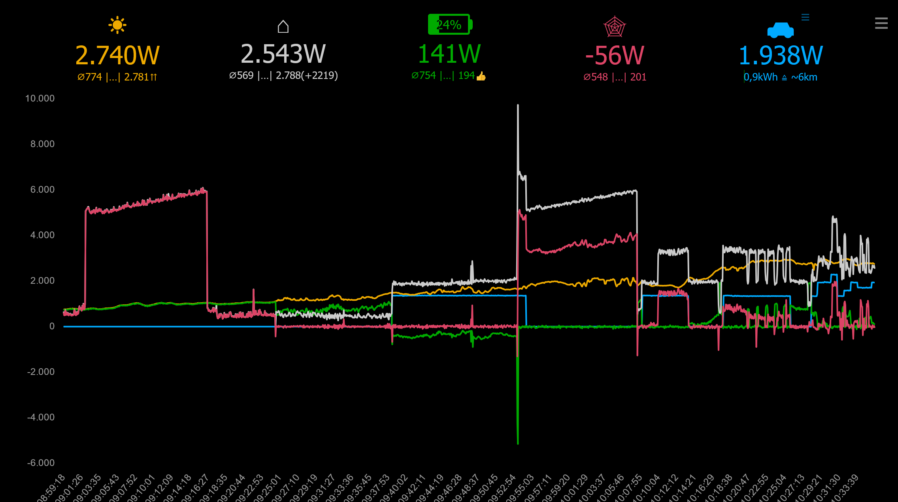

# PVist
Photovoltaik ist-Werte anzeigen für [S10 PV-Anlagen](https://www.e3dc.com/) der Firma E3DC. 
Optional mit einer [go-e Charger Gemini Wallbox](https://go-e.com/) und [PV-Überschussladen](https://www.google.com/search?q=pv+%C3%BCberschussladen).

PVist ist
- eine [portable Anwendung](https://de.wikipedia.org/wiki/Portable_Software) für Windows 10 & 11 und macOS, die ohne einen dedizierten Server auskommt
- ein nicht-kommerzielles Freizeitprojekt, Einsatz auf eigene Gefahr
- leicht zu installieren
- auch als reine Serverversion ohne Electron verfügbar
- kein Ersatz für die go-e App, sondern eine Ergänzung zur PV-Überschussladung
- für die Verwendung mit Handys oder Tablets geeignet

## Display
PVist erzeugt diese Grafik sowohl in der App als auch via Netzwerk in Browsern:

Die numerischen Werte werden oben dargestellt: 
Aktuelle Leistungsdaten, darunter kleiner die Durchschnittswerte am Anfang und am Ende des dargestellten Zeitraums über 20 Messwerte (optional, einstellbar)

Die Liniengrafik darunter:
- Gelb: PV Leistung
- Weiß: Hausverbrauch
- Grün: Leistung und Zustand der PV-Batterie, positiv = laden, negativ = entladen
- Rot: Leistung des externen Netzes 
- Blau: Leistung der Wallbox. Energie der letzten Ladung, umgerechnet in Kilometer (einstellbar)

Die weiß-roten Trapeze werden durch eine taktende Wärmepumpe verursacht. Anlaufleistung der WP bis knapp 10kW. Um 10:10 kommt eine Waschmaschine dazu. 
Die WB (blau) versucht, dem PV-Überschuss zu folgen.

Da die Batterie (grün) nur bis 20% entladen werden darf (konfigurierte Reserve), muss zeitweise das EVU (rot) einspringen. 
Überschüssige Leistung fliesst in die Batterie, da die WB-Überschussladung eine größere Totzeit hat.
An einem Januarmorgen reicht die PV-Leistung noch nicht aus, um den Bedarf zu decken.
Bis zu 4096 Messwerte in beliebigen Intervallen von 1 bis 60 Sekunden werden dargestellt.

## Voraussetzungen für den Betrieb

- Windows 10, 11 oder aktuelles macOS, Intel oder Apple Silicon CPU
- für die Serverversion Linux, Windows, MacOS oder andere OSe, sofern ein NodeJS und `npm` installiert sind. Weitere Details im Redame der .zip-Datei.
  Die Serverversion kommt ohne Electron, ist praktisch wartungsfrei und kann 24/7 laufen
- der Modbus der S10 muss aktiviert sein:
  Hauptmenü -> Smart-Funktionen-> Smart Home 2x aktivieren
  Eintrag muss grün unterlegt sein, Port 502 wie voreingestellt verwenden

- die IP-Adresse oder Netzwerkname der S10 muss bekannt sein, Beispiele:
	Netzwerkname: `http://S10.fritz.box` oder IP-Adresse: `http://192.168.2.1`

	Zu finden im Netzwerk-Router (FritzBox etc) oder im S10 Hauptmenü -> System -> Netzwerk- > System-IP
	
- falls eine go-e Wallbox eingebunden werden soll: 
	- die IP-Adresse oder Netzwerkname der Wallbox muss bekannt sein. Beispiele: 
	`http://go-echarger-123456.fritz.box` oder `http://192.168.2.1`
	- Ggf. das API V2 der WB in der go-e Handy-App freischalten:
	“Internet” -> “Erweiterte Einstellungen” -> “Lokale HTTP API v2 erlauben”
	- wenn zusätzlich PV-Überschussladen eingesetzt werden soll: 
	WB-Firmware 55.5 oder später in der go-e Handy-App unter “Internet” -> “Firmwareversion”

## Installation
Passende [Datei herunter laden](https://drive.google.com/drive/folders/1oy1mYJ1L3km5SP5DC9LIV0oxdpZBdO23) & in ein beliebiges Verzeichnis entpacken:
- Windows 10 & 11: PVist-win32-x64-[versionsnummer].7z
- Mac Intel: PVist-darwin-x64-[versionsnummer].7z
- Mac Apple Silicon: PVist-darwin-arm64-[versionsnummer].7z
- Serverversion: PVIST-Server-[versionsnummer].7z

Im Download-Verzeichnis befindet sich immer die aktuellste Version mit dem aktuellsten readme.txt

### Server-Version
Die Server .zip Datei herunterladen, npm install und mit NodeJS starten (siehe readme)

### Windows 10 & 11
PVist ist portabel, dh. es braucht keine eigentliche Installation und kann von einem beliebigen Verzeichnis sofort ausgeführt werden.

-	PVist.exe starten 
	Beim ersten Start erscheint ein Windows-Dialog mit dem "Windows-Sicherheitshinweis" für die Firewall-Freigabe: 
	Falls PVist auch im Netzwerk z.B. von Handy, Tablets odere anderen PCs verwendet werden soll: 
	Haken bei "Private Netzwerke" setzen, dann "Zugriff zulassen" setzen (erfordert Admin-Rechte)

	PVist läuft auch ohne Freigabe durch die Firewall, dann allerdings lokal ohne Zugriffsmöglichkeit auf seine Webseite aus dem Netzwerk.

### Mac
- PVist starten
- gegebenenfalls die Firewall unter Systemeinstellung -> netzwerk -> Firewall anpassen, wenn PVist im Netzwerk verwendet werden soll

### Alle Versionen
Beim ersten Aufruf wird automatisch der Einstellungs-Dialog angezeigt

- Feld "IP-Adresse": 
IP-Adresse oder Netzwerkname der S10 
Alle anderen Felder nicht verändern, Button "Speichern" klicken.

Wenn alles geklappt hat wird jetzt eine Linien-Grafik aufgebaut. Zu den oben angezeigten, letzten Werten und Statistiken gibt es jeweils Tooltips. 

Oben rechts können Einstellungen Einstellungen vorgenommen werden.

Wird das Hauptfenster geschlossen, dann wird auch der Server beendet.

### PVist… 
- belegt keine Ressourcen, wenn es beendet ist
- installiert keine Dienste, modifiziert nicht die Registry 
- telefoniert nicht nach Hause, zeigt keine Werbung an
- braucht keinerlei externen Ressourcen, auch nicht die von E3DC oder go-e
-	wer zusätzlich eine go-e Wallbox mit aktiviertem lokalen API V2 hat, kann unter den Einstellungen deren URL eingeben.
	Beispiele:
	`http://go-echarger-123456.fritz.box/api/` oder	`http://192.168.x.y/api/`

	Dann werden zusätzlich der Leistungsverlauf und die zuletzt geladene Energie der WB in Blau angezeigt. 
	Es wird zusätzlich ein blaues Auto-Symbol angezeigt, über das weitere Einstellung vorgenommen werden können. Dort kann das PV-Überschussladen aktiviert werden.

- wenn die Funktion "CSV-Datei abspeichern" aktiviert wird, erzeugt das Programm für jeden Tag eine neu CSV-Datei, in der die angezeigten Werte abgelegt werden. Die CSV-Dateien werden auf dem PC abgelegt, auf dem PVist läuft unter

	- Windows: 
	Windows-Verzeichnis für temporäre Dateien, das den symbolischen Namen "%temp%" hat (im Dateiexplorer eingegeben)
	- Mac: 
	Dokumentenordner

	Die Dateien können z.B. mit Excel, Calc, oder Numbers weiter verarbeitet werden.
	Wenn die aktuelle Datei gesperrt wird (z.B. durch eine Tabellenkalkulation), kann PVist keine weiteren Daten hinzufügen.
	Diese Dateien entstehen täglich neu und werden von PVist nicht gelöscht.

## Anmerkungen
### Status-Icon
- das Programm erzeugt ein Symbol im Infobereich (Windows) oder oben (Mac)
- Klick = PVist-Fenster anzeigen/verstecken, das Programm läuft dann im Hintergrund weiter
- Rechtsklick auf des Icon: Menü

### Tasten
- `Leertaste` Pause/Weiter
- `e` Einstellungen
- `l` Log einblenden 
- `<Strg>-r` Bildschirm erneuern
- `F11` Vollbild
- `d` Dark Mode
- `h` Heller Mode

### Aufruf über das Netzwerk
PVist ist ein https-Server und kann auch aus dem LAN / WLAN / Internet (per VPN) via

	https://[pcname bzw IP-Adr]:26180 

mit jedem Browser aufgerufen werden. Der dann folgende, einmalige Sicherheitshinweis bzgl. eines selbst ausgestellten Zertifikats kann getrost ignoriert werden, da der Web-Server selbst betrieben wird.
Bei Bedarf kann die Portnummer geändert werden und es können gültige Zertifikate installiert werden.

### Zeitliche Auflösung
Die zeitliche Auflösung der Grafik kann per Menü rechts oben zwischen einer und 60 Sekunden gewählt werden, sie gilt für alle Betrachter der Grafik. Die Kurven werden nicht geglättet.
Es sind auch Auflösungen unter einer Sekunde möglich, wenn man die Konfigurationsdatei (JSON) direkt bearbeitet.

### Zoom / Cursor
Beliebige Zeitfenster aus der Grafik können mit der linken Maustaste markiert werden. Der gestrichelte vertikale Cursor zeigt den genauen Zeitpunkt und dessen genauen Werte an. Werden mehrere Werte angezeigt, dann gibt es mehrere Messwerte an dieser Stelle (auflösungsbedingt).

Zoom beenden: Button rechts oben klicken.

### Statistik
Wenn während einer Pause (Leertaste) ein Bereich markiert wird, wird links eine Statistik eingeblendet, die z.B. in Excel per Cut&Paste weiter verwendet werden kann.

Auf diese Weise kann man z.B. den realen COP einer Wärmepumpe während der Warmwasserbereitung gut abschätzen.
Man weis, wie viel Wasser (bauseits) mit welchem Energieeinsatz (PVist) um welche Temperatur (WP-Anzeige) erwärmt wurde. 

### Überschussladen mit einer go-e Wallbox
Damit PVist die aktuellen Leistungswerte regelmäßig an die WB überträgt, muss in den PVist-Einstellungen das Häkchen "Laden mit PV-Überschuss" gesetzt werden (klick auf das Auto). 

Dann werden alle 5 Sekunden die aktuellen Werte an die WB übertragen, was diese ggf. zur Anpassung der Ladeleistung veranlasst. Die Regelung der Ladeleistung ist Sache der WB, PVist versorgt sie mit den PV-seitigen Parametern dafür. Die Wallbox muss zuverlässig im Netzwerk erreichbar sein. 

Weitere Voraussetzung dafür ist, dass in den ECO-Einstellung der Handy-App die Überschussladung aktiviert ist. Alle anderen Parameter (Leistungslimit, wann Phasenumschaltung, Vorrang etc.) werden einmalig ebenfalls dort eingestellt.

Wenn alles richtig konfiguriert ist, muss nur noch das Auto eingesteckt werden, die Ladung mit der Überschussleistung der PV startet dann nach kurzer Zeit automatisch. Achtung, auch das Auto kann die Leistung beeinflussen.

Schwindet die PV-Leistung oder ist das Auto geladen, wird die Ladeleistung reduziert oder die Ladung beendet. 

Es kann einige Sekunden dauern, bis die WB ihre Leistung an eine veränderte PV-Leistung anpasst, z.B. bei Wolken. 

Bei einem Wechsel der Anzahl der Phasen kann es zu einigen Sekunden Unterbrechung des Ladevorganges kommen.

Die Ladung des Autos wird höher als das Laden des S10-Akkus priorisiert.

Es kann eine maximale Ladeenerige vorgegeben werden, wenn das Ladeende nicht durch das Auto bestimmt werden soll.

### Sicherheit
PVist ist für den Inhouse-Gebrauch gedacht und bringt keine bekannten Sicherheitsprobleme mit sich. Es betreibt einen eigenen, rudimentären Webserver. 

Theoretisch können seine Dienste auch direkt ins Internet gestellt werden, wovon aber abzuraten ist. Dann könnte jeder beliebige Internet-Teilnehmer die Konfiguration verändern.

Es spricht aber nichts dagegen, es auch von unterwegs via VPN zu verwenden. 

Hinweise auf etwaige Schwachstellen nimmt der Autor gerne an.

Das Programm nimmt keinerlei Einstellungen an der S10 vor, lediglich die Wallbox wird mit Werten und Parametern versorgt.

## De-Installation (???)
### Windows
- das PVist-Installationsverzeichnis mitsamt allen Unterverzeichnissen löschen
- das Verzeichnis %appdata%/PVist mitsamt allen Unterverzeichnissen löschen
- ggf. angelegte Firewall-Regeln löschen (Systemsteuerung -> “Apps über die Windows-Firewall kommunizieren lassen”)
### Mac
- App löschen
- ggf. Firewall zurücksetzen

## FAQ
1.	Warum sind die Dateien bei Google Drive gehostet? 
	- weil unbezahltes Github eine magische Grenze für Dateien über 100MB hat
	- weil es wenig Sinn hat, so große .zip-Dateien zu versionieren

1.	Warum sind hier keine Sourcen? 
	Weil ich derzeit keine Zeit habe, sie öffentlich zu pflegen. Vielleicht wird sich das zu einem späteren Zeitpunkt noch ändern. 
 	Außerdem kann man hier das Projekt gut verwalten (Issues, Readme etc). Bei mir läuft PVist 24/7 völlig ohne Probleme und wartungsfrei.
	  	
1.	Ist das Malware? 
	Nein, ich verwende es selbst auch 😉. Es wäre auch eine komische Idee, Malware in JavaScript/Electron zu schreiben. Das Javascript kann eingesehen werden.

1.	Warum hast Du PVist geschrieben? 
	- weil ich die Grafiken von E3DCs Webeite zu wenig aufgelöst und zu sehr geglättet fand
 	- weil ich nicht jedes mal in Keller gehen wollte, um die aktuellen Werte und Trends zu sehen
	- weil ich Überschussladen realisieren wollte ohne dafür einen extra Server zu installieren
 	- weil ich den tatsächlichen COP meiner Wärmepumpe ermitteln wollte
	- weil ich schon immer mal die Idee ausprobieren wollte, einen Server in Electron zu schreiben
	- weil ich meine eigenen Daten nicht von fremden Servern abfragen will ("Digitale Souveränität")
